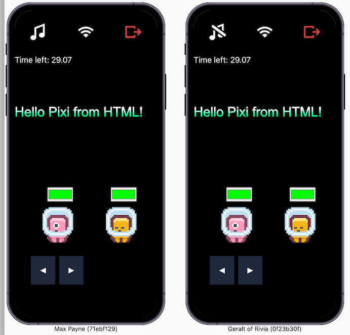

# Rune Pixi-React Starter

This is a starter project to create Rune games using react and @pixi/react (a react renderer for pixi.js). If you're already familiar with React, then this is a great way to build 2D games.

Try the demo here: https://app.rune.ai/dev-UnJquSHU



## Design Motivation

### Combine HTML and Pixi into one React app to get the best of both worlds

1. Build your game's HUD/interface using HTML (react-dom). Why?

   a. Better accessibility

   b. `<div>`s and text nodes are just so much easier, faster to write, and readable than creating Pixi Containers and Text elements with `style={new TextStyle({...`

   c. CSS Grid and Flex make it super easy to create responsive layouts

   d. CSS is just easier and more powerful than Pixi's equivalent styling

   e. If you like Tailwind, use tailwind util classes to style your elements even more conveniently

2. Build your actual game using Pixi (@pixi/react). Why?

   a. Performance. Pixi uses webGL under the hood to take advantage of the GPU

   b. Pixi can handle animating thousands of sprites per tick, this is just not possible with e.g. `<div>`s or ``s because of overhead of the browser's reflow and repaint when elements change

   c. You can write graphics shader programs to create impressive effects

We use tunnels to seamlessly combine both HTML and Pixi objects together. If you have a DOM component that needs to add something to the Pixi canvas, just put it inside `<Pixi.In></Pixi.In>`. Likewise, if you have a Pixi component that needs to render something to the DOM, put it in `<Html.In></Html.In>`

Example:

```jsx
export function Character({ playerId }) {
  const hp = useGameStore((state) => state.game.players[playerId].hp)
  const position = useGameStore((state) => state.game.players[playerId].position)

  return (
    <>
      <Sprite image="character" position={position} />
      <Html.In>
        <div className="hp-bar">{hp}</div>
      </Html.In>
    </>
  )
}
```

## App Architecture

### logic.ts

Our entire game's logic is stored here. If you're not familiar with Rune, [read the docs here](https://developers.rune.ai/docs/quick-start).

### Screens

These are the highest-level components in our app and represent the broad states of our game. Some example screens you might build:

`Lobby` screen, the first screen that is shown. This is where players "ready up" before the game begins.

`Play` screen, the main screen that renders the core gameplay loop.

optional: `GameOver` screen.

You might build more or different screens than this depending on your game.

`logic.ts` drives which screen is shown.

### useGameStore

We use [Zustand](https://github.com/pmndrs/zustand) to store our game state so that our components can easily and _performantly_ grab the data they need, and only re-render when the data they care about changes.

There are 3 ways we typically access data from the store:

#### Reactively, inside a component

```jsx
function Character() {
    const hp = useGameStore((state) => state.game.hp)
    return (
        ...
    )
}
```

`Character` will re-render when `hp` changes.

#### Imperatively, in a callback/outside a component

`useGameStore` is not only a hook. We can access it from anywhere, anytime by calling `useGameStore.getState()`. This is useful in callbacks and non-React parts of our app.

```js
const hp = useGameStore.getState().game.hp
```

#### Using a subscription

If we want more control over when a component re-renders (like only for certain values), or if we want to manipulate objects directly without re-rendering, we can subscribe to changes.

```jsx
useEffect(() => {
  const unsubscribe = store.subscribe(
    (state) => state.game.position,
    (position) => {
      playerRef.current.position = position
    },
  )
  return unsubscribe
}, [])
```

`subscribe` takes 2 arguments, a selector to select some part of the state, and a callback that will be called with the selected value every time it changes.

This is useful for state that changes rapidly. If we had to re-render the whole component every time, that wouldn't be good for performance.

### useInitClient and useLoadAssets

These hooks are both called within `<App>`. `useInitClient` initializes the Rune client (`Rune.initClient({...})`). `useLoadAssets` is where we take care of loading things before the rest of our components are rendered.

### Interpolators

An interpolator gives us an in-between value from the last state to the next state. This is useful when you want a value updated more frequently in the client than it really updates in `logic.ts`. For example, in an action platformer you'd want very smooth movement of character positions. In `<Character>`, we hook into Pixi's ticker to update the position on every tick (typically the refresh rate of the player's browser) which is much more frequent than `logic.ts`'s `updatesPerSecond` (10 in this starter).

You don't need to create interpolators for everything.

I store my interpolators in `useGameStore` under `interpolators` and mirror the structure of GameState. (e.g. `game.players[playerId].position.x` --> `interpolators.players[playerId].position.x`). You don't have to do this, but I find it makes it clear what value is being interpolated.

## That's pretty much it

That was a high-level overview. For more information on how each of the libraries mentioned above works, check their docs.

## Attributions

Sprites used in this starter were created by Kenney.nl

https://www.kenney.nl/assets/pixel-platformer

[Creative Commons CC0](https://creativecommons.org/publicdomain/zero/1.0/)
